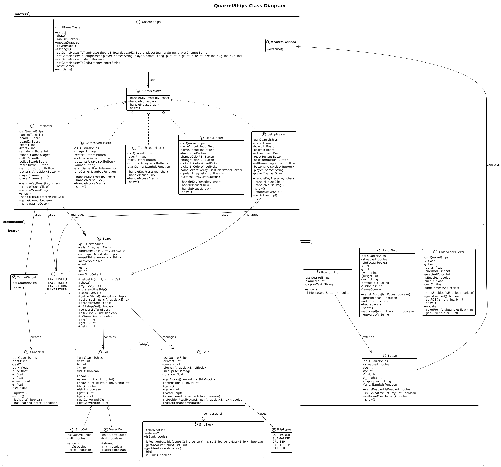

# QuarrelShips - Java Battleships Game

[](https://openjdk.org/)
[](https://processing.org/)
[](https://gradle.org/)
[](https://junit.org/)

A modern, feature-rich implementation of the classic Battleships game built with Java and the Processing graphics library. QuarrelShips offers an intuitive graphical interface, customizable ship placement, and engaging turn-based gameplay for two players.



## 🎮 Features

### Core Gameplay

- **Classic Battleships Rules**: Traditional naval combat gameplay with strategic ship placement
- **Two-Player Local Multiplayer**: Hot-seat gameplay for two players on the same device
- **Real-time Feedback**: Visual feedback for hits, misses, and ship destruction

### Ships Fleet

- **Destroyer** (2 cells)
- **Submarine** (3 cells)
- **Cruiser** (3 cells)
- **Battleship** (4 cells)
- **Carrier** (5 cells)

### Technical Features

- **Custom Game Engine**: Built on Processing framework for smooth graphics
- **Modular Architecture**: Clean separation of concerns with game masters pattern
- **Comprehensive Testing**: Full unit test coverage with JUnit 5
- **Gradle Build System**: Modern build automation and dependency management

## 🚀 Quick Start

### Prerequisites

- **Java 17+** - [Download OpenJDK](https://openjdk.org/)
- **Gradle 8.0+** - [Installation Guide](https://gradle.org/install/)

### Installation

1. **Clone the repository**

   ```bash
   git clone <repository-url>
   cd quarrelships
   ```

2. **Build the project**

   ```bash
   ./gradlew build
   ```

3. **Run the game**

   ```bash
   ./gradlew run
   ```

## 🎯 How to Play

### Game Setup

1. **Start Game**: Launch QuarrelShips and click "Start Game"
2. **Enter Names**: Both players enter their names
3. **Ship Placement**: Each player places their fleet on their board

### Gameplay

1. **Take Turns**: Players alternate turns attacking the opponent's board
2. **Target Selection**: Click on a cell on the opponent's board to fire
3. **Hit/Miss Feedback**:
   - 🔴 **Hit**: Red indicates a successful hit on a ship
   - ⚪ **Miss**: White indicates a missed shot
4. **Bonus Shots**: Successful hits grant additional shots in the same turn
5. **Victory**: First player to sink all opponent ships wins!

### Controls

- **Left Click**: Select/Fire at target
- **R**: Rotate ships during placement

## 🏗️ Architecture

QuarrelShips follows a clean, modular architecture using several design patterns:

### Game Masters Pattern

The game uses a state machine approach with different "Game Masters" handling each phase:

- **TitleScreenMaster**: Main menu and navigation
- **SetupMaster**: Ship placement phase
- **TurnMaster**: Active gameplay and turn management
- **GameOverMaster**: End game screen and results

## 🧪 Testing

QuarrelShips includes comprehensive unit tests covering all major components:

### Run All Tests

```bash
./gradlew test
```

### Generate Test Report

```bash
./gradlew test --continue
# Report available at: build/reports/tests/test/index.html
```

## 📊 Documentation

### Available Documentation

- **[Code Analysis](CODE_ANALYSIS.md)**: Detailed code quality analysis
- **[Test Summary](TEST_IMPLEMENTATION_SUMMARY.md)**: Testing implementation overview

## 🔧 Development

### Project Structure

- **Gradle Build**: Modern build system with dependency management
- **Processing Graphics**: Hardware-accelerated 2D graphics rendering
- **JUnit Testing**: Comprehensive test suite with mocking

### Key Dependencies

```gradle
dependencies {
    implementation 'org.processing:core:4.3.3'
    testImplementation 'org.junit.jupiter:junit-jupiter:5.10.0'
    testImplementation 'org.mockito:mockito-core:5.1.1'
}
```

### Building from Source

```bash
# Clean build
./gradlew clean build


```

## 🐛 Troubleshooting

### Common Issues

**Game window doesn't appear:**

- Ensure Java 17+ is installed and in PATH
- Check graphics drivers are up to date
- Try running with `--debug-jvm` flag

**Build failures:**

- Run `./gradlew clean` before building
- Verify Gradle wrapper permissions on Unix systems

**Performance issues:**

- Close other graphics-intensive applications
- Update graphics drivers

## 🤝 Contributing

1. Fork the repository
2. Create a feature branch (`git checkout -b feature/AmazingFeature`)
3. Run tests (`./gradlew test`)
4. Commit changes (`git commit -m 'Add AmazingFeature'`)
5. Push to branch (`git push origin feature/AmazingFeature`)
6. Open a Pull Request

### Code Style

- Follow Java naming conventions
- Add JavaDoc comments for public methods
- Run `./gradlew check` before committing

## 📝 License

This project is licensed under the MIT License - see the LICENSE file for details.

## 🙏 Acknowledgments

- **Processing Foundation** - For the excellent graphics framework
- **Classic Battleships** - For the timeless game concept
- **JUnit Team** - For the robust testing framework
- **Gradle** - For the powerful build system
- **Us** - Cause like we have to shout ourselves out as well 😎

---

## Enjoy playing QuarrelShips! ⚓🎯

For questions or support, please open an issue on the project repository.
